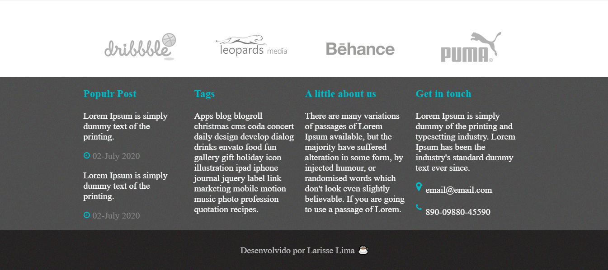

<h1 align="center" >
    Web World
</h1>

<h3 align="center">
    Projeto desenvolvido para estudos de desenvolvimento web
</h3>

## 🛠 Tecnologias

O projeto foi desenvolvido utilizando as seguintes tecnologias:

- HTML
- CSS
- JavaScript

## 🎨 Layout
https://worldweb.netlify.app/

<b>Feito com 	:coffee:   por Larisse Lima</b>

